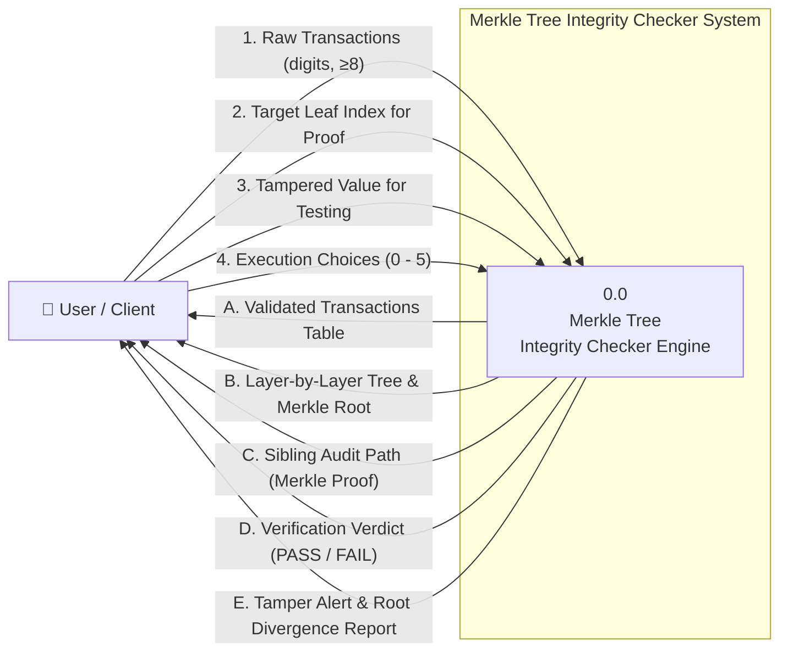
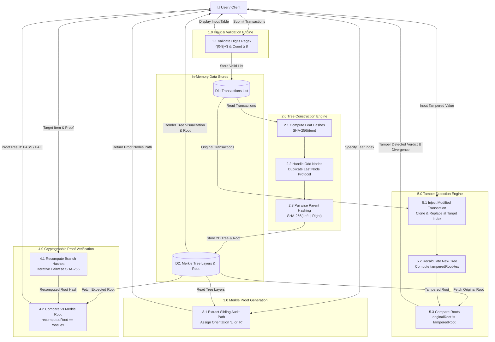

# Project 3 — Merkle Tree Integrity Checker

> **SHA-256 Proof and Tamper Detection System**  
> Course: Blockchain Technology & Cryptography  
> Group: **Group 3**

## 📌 Project Overview

This project implements a complete, enterprise-grade **Merkle Tree Integrity Checker** in Java 21 conforming strictly to Blockchain cryptographic standards.

It provides bottom-up cryptographic tree construction, sibling audit path generation (Merkle Proof), proof verification against the Merkle Root, odd-leaf duplication handling (Bitcoin protocol), and immediate tamper detection.

### 🎯 Key Objectives & Assessment Criteria

* **Objective**:
  * Build a Merkle tree from transactions.
  * Verify any transaction using a Merkle proof.
* **Core Features**:
  * Calculate leaf, parent, and root hashes using `SHA-256`.
  * Demonstrate tamper detection and the cryptographic avalanche effect.
* **Technical Rules**:
  * Use standard SHA-256 hashing.
  * Require at least 8 transactions (strictly digits `0-9`).
  * Correctly handle odd numbers of leaves via duplicate padding.
* **Grading Assessment**:
  * **Correctness (40%)**: Strict mathematical verification and cryptographic hashing.
  * **Design (25%)**: Multi-tier Clean Architecture (MVC separation of concerns).
  * **Testing (20%)**: Comprehensive JUnit 5 test suite and interactive CLI verification suite.
  * **Demo (15%)**: Beautiful ANSI console UI with boxed table banners, color-coded status tracking, and continuous navigation.

---

## 🏛️ Project Architecture

The codebase is organized into standard enterprise packages under `org.example`:

```
Final-Blockchai/
├── pom.xml                               # Maven project configuration (Java 21, JUnit 5)
├── README.md                             # Project documentation
└── src/
    ├── main/
    │   └── java/
    │       └── org/example/
    │           ├── Main.java             # Clean application bootstrap entry point
    │           ├── MerkleTreeChecker.java# Assignment entry point alias
    │           ├── controller/
    │           │   └── MerkleTreeController.java  # Interactive CLI loop & flow control
    │           ├── service/
    │           │   └── MerkleTreeService.java     # Merkle tree logic & cryptographic operations
    │           ├── model/
    │           │   └── ProofNode.java             # Immutable model representing audit path step
    │           └── utils/
    │               ├── HashUtils.java             # Pure SHA-256 and byte conversion utilities
    │               └── ConsoleUtils.java          # Boxed tables, ANSI colors, and UI formatting
    └── test/
        └── java/
            └── org/example/
                ├── service/
                │   └── MerkleTreeServiceTest.java # Comprehensive Merkle tree unit tests
                └── utils/
                    └── HashUtilsTest.java         # Cryptographic hashing & byte manipulation tests
```

---

## 🔄 Data Flow Diagrams (DFD)

### 1. DFD Level 0 — Context Diagram
The Context Diagram illustrates the system boundary of the Merkle Tree Integrity Checker and its primary interactions with the external user/client.



### 2. DFD Level 1 — Detailed Process Decomposition Diagram
The Level 1 Diagram decomposes the system into 5 primary processes, illustrating how data moves between transformation logic and in-memory data stores (`D1`, `D2`).



---

## ⚡ Core Features & Implementation Details

### 1. SHA-256 Cryptographic Hashing
All hashing operations use `java.security.MessageDigest` configured for `SHA-256`:
* **Leaf Nodes (Layer 0)**: `H(transaction_data)`
* **Parent Nodes (Layer n)**: `H(Left_Child || Right_Child)`

### 2. Odd-Leaf Duplication Protocol
In accordance with standard Bitcoin and blockchain tree algorithms, if any layer contains an odd number of nodes, the last node is duplicated to form a complete pair:
```
Layer size % 2 == 1  -->  level.add(lastNode)
```

### 3. Merkle Proof (Audit Path) Generation
For any transaction at index `i`, the system extracts only the sibling hashes necessary to recompute the root:
* Traverses up through each layer.
* Records the sibling's hash and orientation (`'L'` for left sibling, `'R'` for right sibling).
* Verification complexity is logarithmic: $\mathcal{O}(\log_2 N)$.

### 4. Tamper Detection & Avalanche Effect
When any transaction data is altered, recomputing the tree alters every parent hash up the branch, producing a completely different Merkle Root. The system detects this divergence instantly:
$$\text{originalRoot} \ne \text{tamperedRoot} \implies \text{TAMPER DETECTED}$$

### 5. Strict Input Validation (Regex)
Transactions enforce strict digit validation using:
```java
public static final Pattern TRANSACTION_PATTERN = Pattern.compile("^[0-9]+$");
```
Any non-digit inputs, alphabets, special characters, or blank entries are immediately rejected with clear correction guidance.

---

## 💻 How to Build and Run

### Prerequisites
* **Java Development Kit (JDK)**: Version 21 or higher
* **Apache Maven**: Version 3.8 or higher (optional, standard `javac` also supported)

### Option A: Run via Maven
```bash
# Compile and package
mvn clean package

# Run the application
mvn exec:java -Dexec.mainClass="org.example.Main"

# Execute unit tests
mvn test
```

### Option B: Run via Standard Terminal / Command Line
From the project root:
```bash
# Compile all source files
javac -d target/classes src/main/java/org/example/utils/*.java src/main/java/org/example/model/*.java src/main/java/org/example/service/*.java src/main/java/org/example/controller/*.java src/main/java/org/example/*.java

# Run the program
java -cp target/classes org.example.Main
```

---

## 🖥️ Interactive Console Demo Walkthrough

Upon launching, the interactive menu displays all operations:

```text
+----------------------------------------------------------------------------------------+
|                       PROJECT 3 — MERKLE TREE INTEGRITY CHECKER                        |
|                           SHA-256 PROOF AND TAMPER DETECTION                           |
+----------------------------------------------------------------------------------------+
|  1. CREATE TRANSACTIONS                   |  2. BUILD MERKLE TREE                      |
|  3. VERIFY PROOF                          |  4. DETECT TAMPERING                       |
|  5. VERIFICATION TESTS                    |  0. EXIT PROGRAM                           |
+----------------------------------------------------------------------------------------+
Enter your choice (0-5): 
```

### Menu Options:
* **Option 1: CREATE TRANSACTIONS**  
  Prompts for minimum 8 digit-only transactions (or press Enter for default `[10, 20, 30, 40, 50, 60, 70, 80]`). Outputs the formatted input transactions table.
* **Option 2: BUILD MERKLE TREE**  
  Computes and visualizes the full hierarchical tree layer-by-layer (Leaves $\rightarrow$ Parents $\rightarrow$ Root) with SHA-256 hashes.
* **Option 3: VERIFY PROOF**  
  Prompts for a transaction index, generates its audit path, and verifies the proof against the active root.
* **Option 4: DETECT TAMPERING**  
  Demonstrates tamper resistance by modifying a selected transaction, recalculating the tree, and verifying that the root changes.
* **Option 5: VERIFICATION TESTS**  
  Executes the 5 assignment verification scenarios in console with instant `PASS [✓]` status.
* **Option 0: EXIT PROGRAM**  
  Terminates the program gracefully with Exit Code 0 and displays the session closed banner.

> **Visual Feature**: Whenever a case is completed, its menu item turns **Bold Red** in the main menu to track your progress!

---

## 🧪 Verification & Test Suite

The project includes both automated JUnit 5 tests and an interactive verification suite:

| Test Case | Verification Target | Expected Result | Status |
|:---|:---|:---:|:---:|
| **Test 1** | Input transactions produce one valid root | 64-character hex root | ✅ `PASS` |
| **Test 2** | Valid proof for selected transaction | `verifyProof() == true` | ✅ `PASS` |
| **Test 3** | Tampered transaction changes Merkle root | `oldRoot != newRoot` | ✅ `PASS` |
| **Test 4** | Odd-count leaf duplication handling (9 leaves) | 5 levels, 1 root | ✅ `PASS` |
| **Test 5** | Strict digit regex validation (`^[0-9]+$`) | Rejects non-digits | ✅ `PASS` |

---

## 📄 License
Academic project prepared for the Blockchain Technology & Cryptography course — All rights reserved © Group 3.
